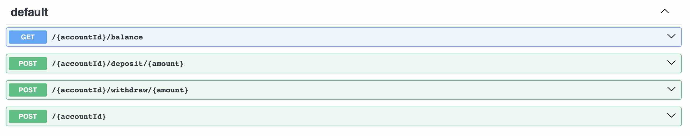

## Bank-account-server

Download : https://github.com/bilal-fazlani/bank-account-server/releases/download/v0.1.0-SNAPSHOT/bank-server.jar

This is a simple bank account server that allows you to create an account, deposit money, withdraw money, and check your balance. It is built using 
  
- Scala
- ZIO & ZIO-Http

This is only in-memory and does not persist data

The server starts at port 9000

Swagger UI is available at http://localhost:9000/docs/openapi

